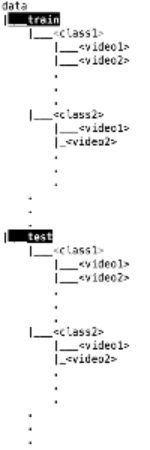

# MovieScope
Idea is to extend video classification for identifying what the genre (romance, horror or action) of a movie is based
on the trailer solely using visual features.
 
Currently, using only spatial CNN features (VGG), to extract features for every frame extracted.
 
Frame extraction can be a challenge in itself. Currently, sampling frame at a fixed timestep. Can also implement
shot-boundary detection, and split the trailers into scenes which might (or not) be useful in training.

<i>MovieScope</i> is certainly, started with movie trailers, which are long videos compared to other videos used for
activity classification and recognition. Will need to use recurrent networks and LSTMs as well Refer to branch "lstm" to
see the implementation.

 

To run the code, first, make changes to the file <code>config/resources.py</code> with the appropriate directory.
 

<h4>Steps to run the program</h4>
<ol>
    <li><code>create_data.py ["need to run twice, one for train data, one for test data; will refine the Code"]</code></li>
    <li><code>create_model.py</code></li>
    <li><code>test_model.py</code></li>
</ol>
 
The program is pretty easy to use, plus the repo contains other auxilliary codes too.

This project was initiated as a class project for Computational Visual Recognition class at UVa (Fall 2016). The project is still under development.

Please contact <mailto>ks6cq@virginia.edu</mailto> for any clarifications or questions.
